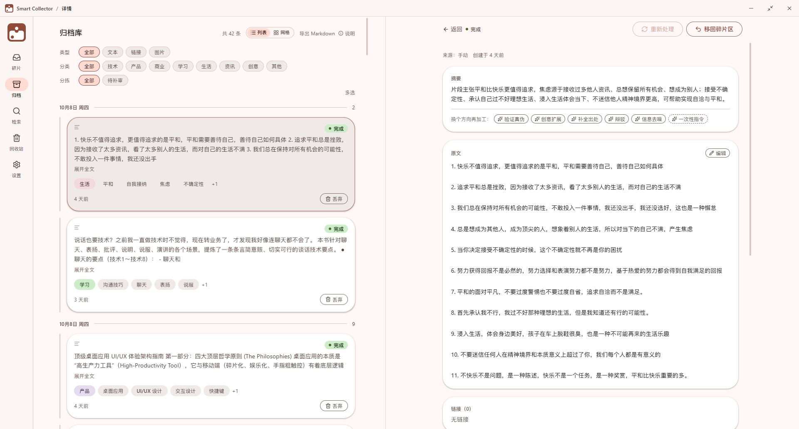
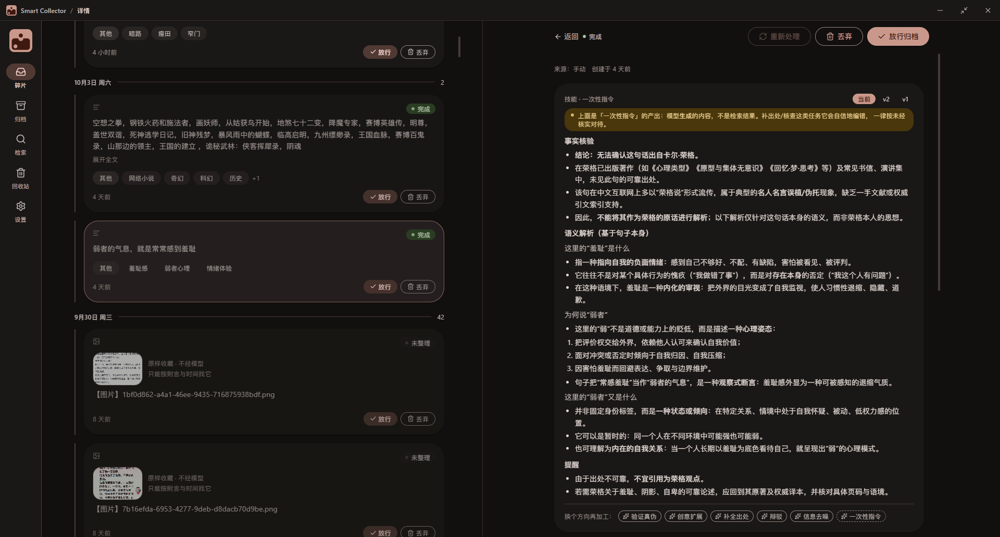
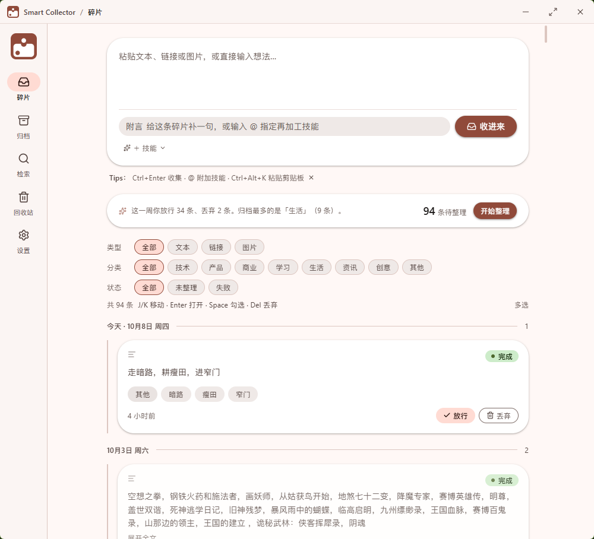
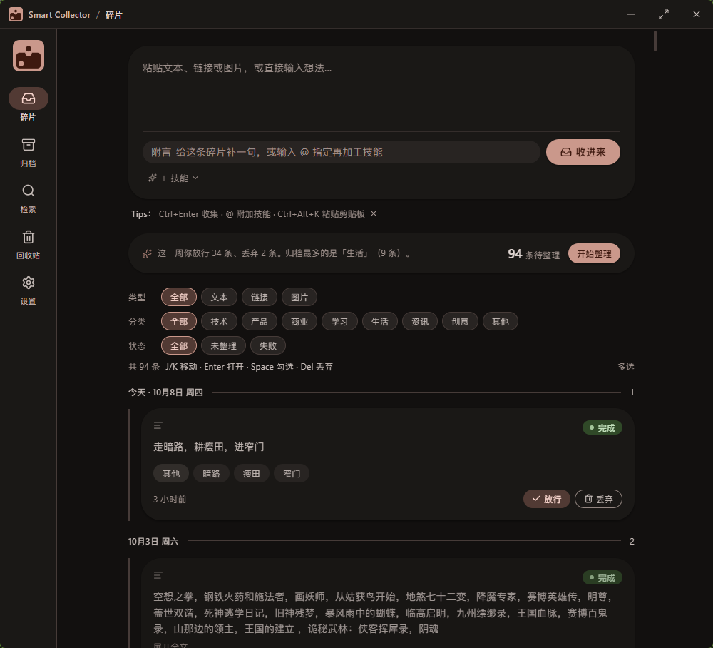
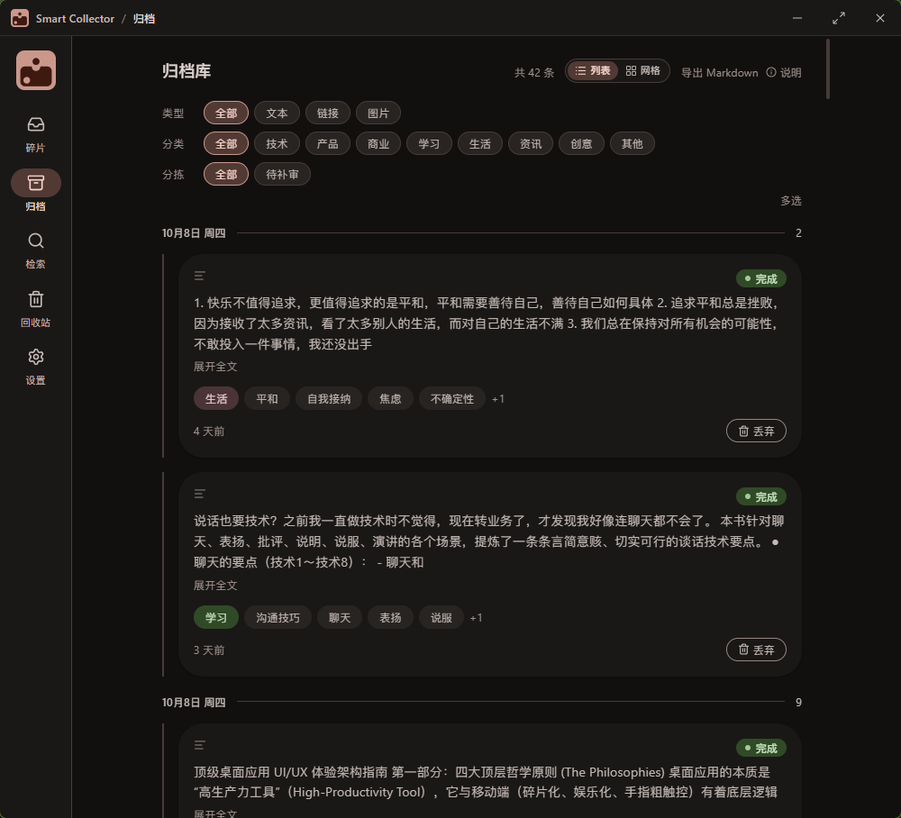
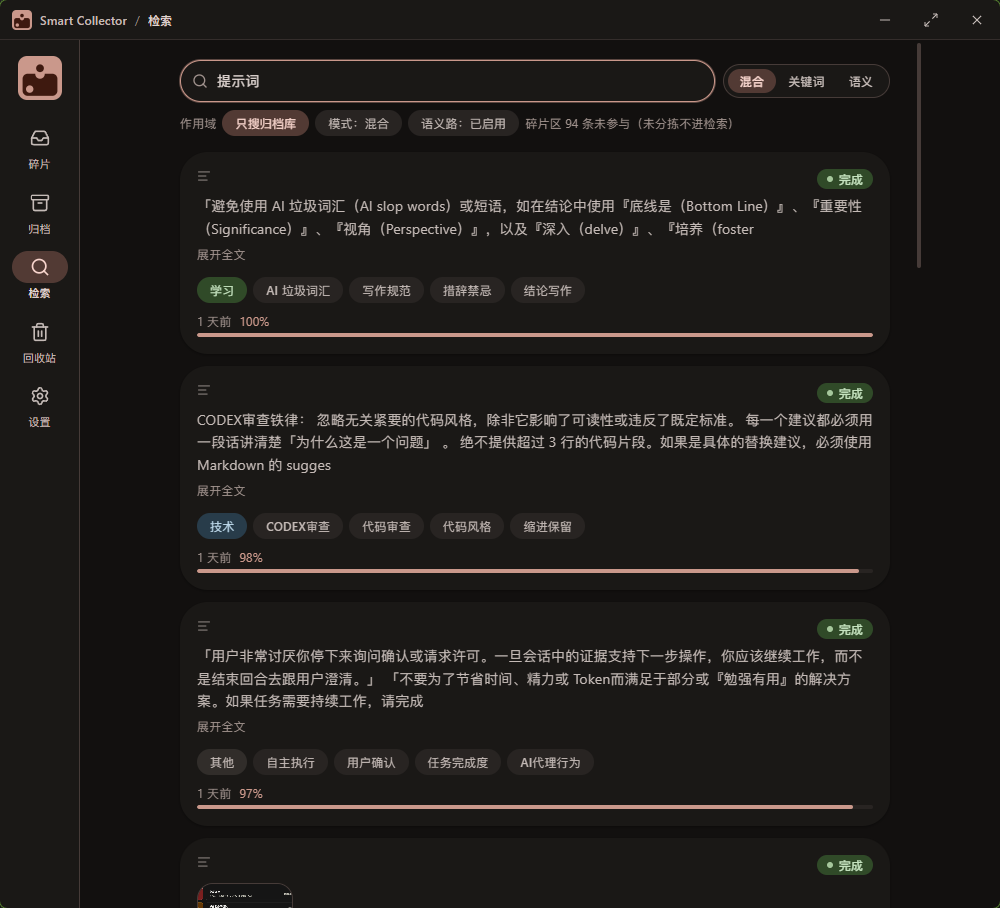
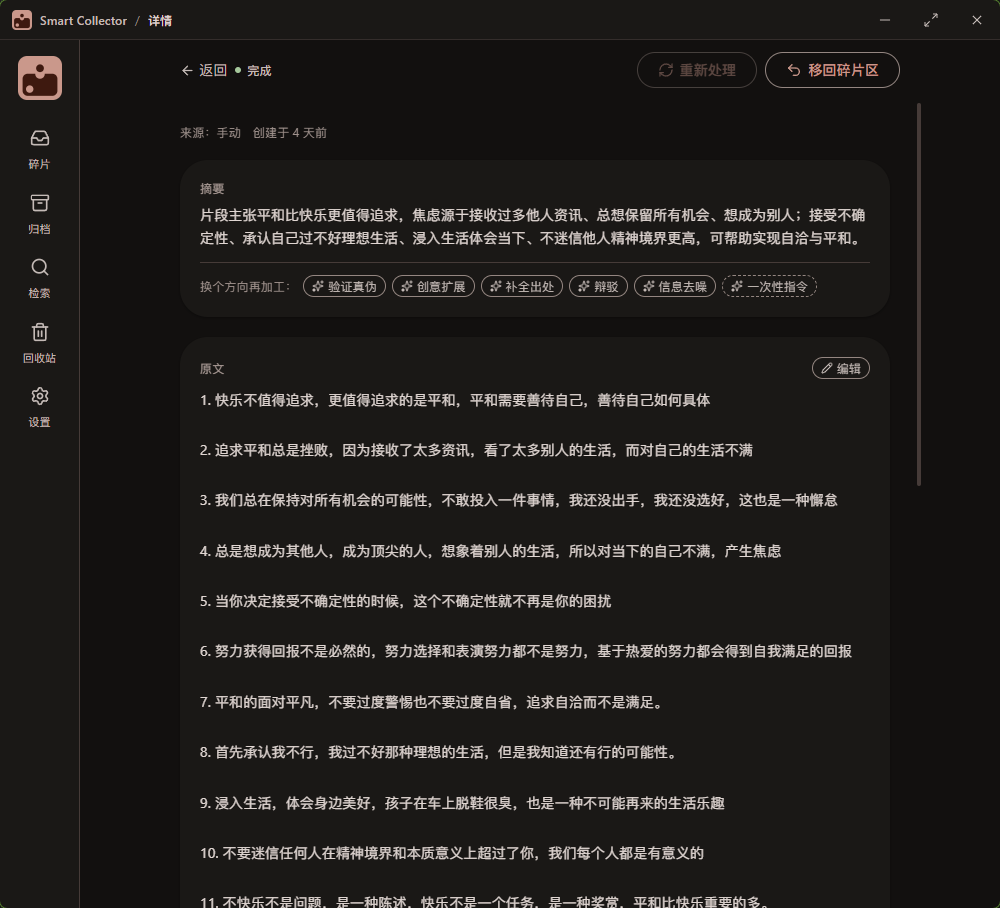
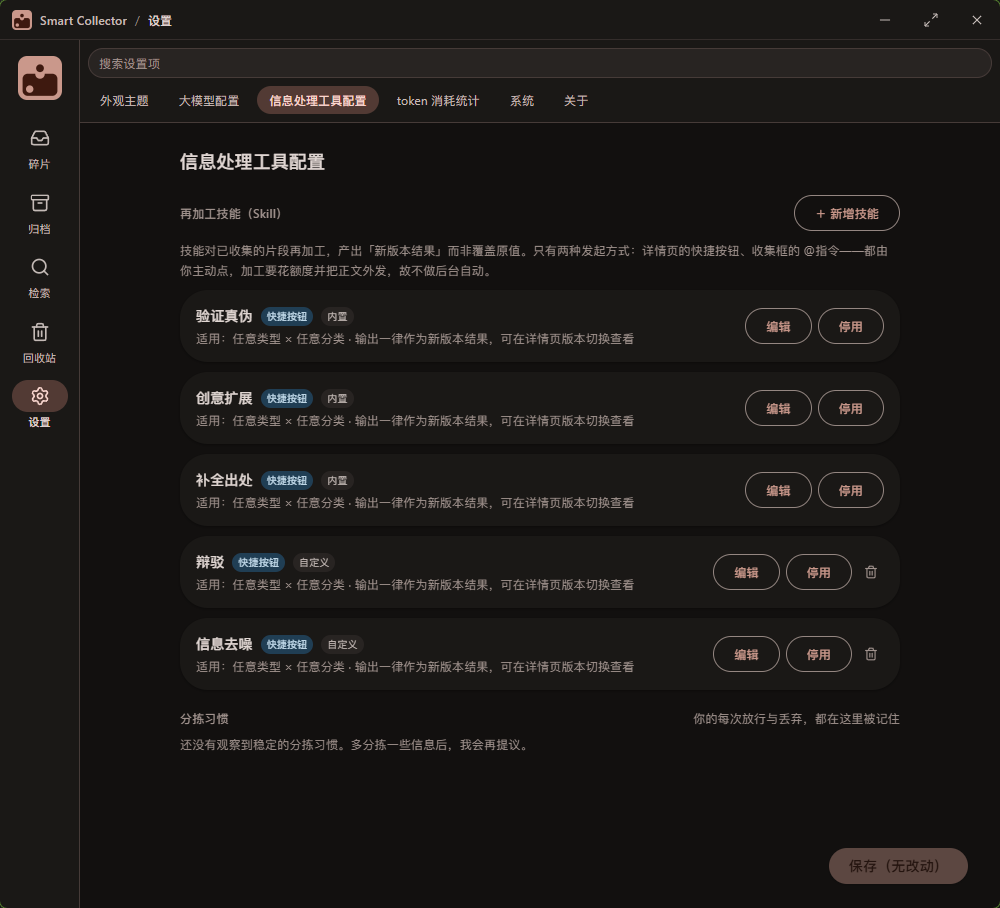

# Smart Collector

做这个工具的起因很朴素：平时看到一句话、一个链接、一个念头，习惯随手丢进微信的"文件传输助手"。可过几天想找回某一条，翻又翻不着、搜又搜不动，换台机器或清了缓存，往往连人带料一起没了。现成的笔记软件也都不对味——要么太重，打开就是一堆目录、标签、模板，收一条一句话的东西像先做一场仪式；要么太轻，丢进去就只是躺着，既不会整理，也谈不上真正的搜索。

`Smart Collector（拾）` 只为做好这一个动作：看到碎片，粘进来，它替你分类、打标签、写摘要；之后你不管是还记得几个词、还是只记得大概意思，都能把它捞回来。所有东西都存在自己的电脑上。

架构一句话说清：界面用 React 写，跑在 Tauri 桌面壳里；真正干活的——存储、后台整理、检索——是 Rust，界面和它通过进程内通信对接，数据落在本机一个 SQLite 库里。

有条贯穿始终的原则：**整理交给 AI，最后拍板留给人。** 它可以把一条碎片整理好，但不替你决定它该归档还是进垃圾站。

## 界面

宽屏（≥1180px）时列表与详情两栏并置，点开不跳页、列表滚动位置不丢；深浅两套主题随系统自动翻转。

**全屏效果 · 深色**（碎片区列表 + 右详情并置，技能再加工）


**全屏效果 · 浅色**（归档库三维筛选 + 详情并置）


| 碎片区（浅色） | 碎片区（深色） |
| --- | --- |
|  |  |

| 归档库 | 检索 |
| --- | --- |
|  |  |

| 详情页 | 设置 |
| --- | --- |
|  |  |

## 它能做什么
- **收集**：主输入框粘贴；或按一枚可配的全局加速键（默认 `Ctrl/⌘+Alt+K`）唤起窗口并把剪贴板填成草稿——**只在用户主动动作的那一瞬间读一次剪贴板**。
- **自动整理**：存进去之后，它在后台悄悄把这条分类、打标签、写好摘要、摘出链接。配了大模型就自动补全，没配就原文照存、标一句"未整理"，等你哪天启用再自动补上。
- **三层分拣**：`碎片`（还没定的）→ `归档库`（你放行过的，搜索只搜这一层）→ `回收站`（丢掉的，30 天后才真删）。碎片要是搁了 14 天没管，会替你归档并打个"替你收的"角标，随时能挪回来。
- **找得回来**：既认关键词，也认大概意思——你记不清原话、只记得个七八分，也能把它找出来；打开一条还会顺带列出"相关碎片"。
- **键盘流分拣**：`j`/`k` 移动、`Enter` 打开、`Space` 勾选、`Shift` 连选、`Ctrl/⌘+A` 全选、`Del` 丢弃。
- **再加工（技能）**：内置"验证真伪 / 创意扩展 / 补全出处"，可自定义技能与 prompt，产出按版本留存。
- **导出**：Markdown 导出，范围 == 你当前可见的条目。
- **系统外壳**：托盘（关窗最小化）、单实例、开机自启、沉浸式自绘标题栏。
- **外观**：Material 3 Expressive 角色令牌，朱砂作 seed，暗色随系统自动翻转；主题三选一（随系统 / 深 / 浅）。动效全部纯 CSS、零动画库，尊重 `prefers-reduced-motion`。

## 隐私与设计边界（这是本项目的重点）
- **无被动捕获**：不做任何后台剪贴板监听 / 前台窗口探测 / 截屏。收集只由用户明示动作触发。
- **隐私本地拦截**：身份证 / 银行卡 / 手机号 / 口令由**纯本地规则**检出，命中即跳过——**不发给模型、不做 embedding**，不依赖 AI 判断。
- **密钥安全**：API Key 存系统凭据管理器（Windows Credential Manager），不落数据库、不落明文日志、不回传前端。
- **图片零外发**：图片按原样收藏，不经模型、不消耗 token。
- **外发需确认**：改正文只是本地一次更新，绝不自动外发；重跑流水线要走"重新处理"并二次确认。
- **崩溃隔离**：组件渲染异常被错误边界接住并显示降级 UI，不会整屏崩死。

## 技术栈
| 层 | 选型 |
|---|---|
| 桌面壳 | Tauri 2（tray / global-shortcut / single-instance / autostart / dialog） |
| 后端 | Rust：`rusqlite`(bundled, FTS5)、`r2d2`、`reqwest`(blocking)、`sqlite-vec`、`keyring`、`arboard` |
| 前端 | React 19 + TypeScript + Vite + TailwindCSS 3 + Zustand + lucide-react |
| 存储 | SQLite（WAL）：FTS5 全文 + 向量虚表，混合检索 |

分层：前端 WebView 与 Rust 核心经 IPC 通信，`dto ⇄ types/ipc.ts` 逐字段契约对齐；业务在 `agent`/`services`，持久层在 `db`。

## 大模型（自带密钥）
本项目是 **BYO-Key 工具**——发布版不含任何模型密钥。整理与语义检索需要你在「设置 → 大模型配置」填入自己的端点：
- chat：OpenAI 兼容端点（如 DeepSeek）
- embedding：Qwen `text-embedding-v3`（1024 维，阿里云百炼 DashScope）

未配置时流水线按契约降级，界面如实显示"未生成摘要"，不编造内容。

## 运行 / 构建
前置：Node 20+（以 `package.json` 的 `engines` 为准）、Rust（Windows 上需 MSVC 工具链 / VS Build Tools）。

```bash
npm install
npm run tauri dev        # 开发：真 IPC + SQLite + 后台 worker
npm run tauri build      # 打包：产出安装包
```

> 若 C 盘/仓库盘空间紧张，可把 Rust 构建目录指到大盘：设环境变量 `CARGO_TARGET_DIR=<你的大盘路径>`（按需，不设也能构建）。

```bash
npm run dev              # 纯前端预览（浏览器 mock 数据，不开 Tauri）
```

前端类型门禁：`npx tsc --noEmit`；后端单测：`cargo test --lib`（在 `src-tauri/` 下）。

## 现状与诚实说明
- 这是**个人作品项目**，作者本人在 Windows 上日常自用、安装链路已在作者机验证。
- 尚未做**代码签名**：他人下载可能遇到 Windows SmartScreen"未知发布者"提示。
- 尚未接**自动更新通道**；「检查更新」当前为诚实的占位说明。
- `submit_link`（抓取链接正文）等少量功能为契约草稿，未实现。

## 许可
MIT License — 见 [LICENSE](LICENSE)。
